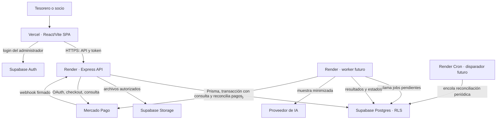

# Arquitectura cloud de MiClub — checkpoint 01

**Fecha de corte:** 28/09/2026  
**Base examinada:** `development` en `ec016b3f44a2380e8ce08048e74a9a3e6b8441a5`  
**Estado:** propuesta de despliegue para revisión del equipo; los servicios descritos aquí no se consideran provisionados por el hecho de figurar en este documento.

## 1. Alcance y criterio de lectura

MiClub es un SaaS multi-tenant para clubes, centrado en padrón, cuotas y cobranza. El checkpoint 01 del TPI pide un diagrama cloud detallado, setup inicial de infraestructura y actividad en el repositorio. Este documento desarrolla la **propuesta de arquitectura** y enumera la evidencia que todavía debe generarse para acreditar el setup. El enunciado reserva para el checkpoint 02 una demo con infraestructura desplegada, backend operativo y pruebas de integración. La integración de pagos en ese hito es una meta de la planificación interna del equipo.

Hay tres niveles de certeza en el texto:

- **Implementado:** comprobable en la rama `development` indicada arriba.
- **Decidido por el proyecto:** expresado en la documentación del dominio, pero aún sin implementación.
- **Propuesto:** proveedor o mecanismo concreto que el equipo debe validar y registrar antes de presentarlo como infraestructura operativa.

La [revisión D6](../../AI-DECISIONS.md) reemplazó Next.js y Vercel Functions por React + Vite en `frontend/` y Node.js + Express + Prisma + PostgreSQL en `backend/`. Varias secciones de [05-arquitectura](../05-arquitectura.md), [10-entrega-academica](../10-entrega-academica.md) y el one-pager siguen describiendo la alternativa anterior; sirven como historial, pero **no definen el despliegue vigente**. La documentación debe reconciliarse después de aprobar esta propuesta.

## 2. Estado comprobado en `development`

| Componente | Evidencia actual | Estado |
|---|---|---|
| Frontend | `frontend/package.json`, `vite.config.ts`, `index.html` y carpetas por contexto | Esqueleto; faltan dependencias, punto de entrada React y pantallas |
| API | `backend/src/app.ts` y `server.ts` con `GET /health` | Esqueleto; el health check devuelve `ok` sin comprobar dependencias |
| Dependencias | `dependencies` y `devDependencies` vacías en ambos `package.json` | El proyecto aún no se instala ni compila de forma reproducible |
| Base de datos | `backend/prisma/schema.prisma` con datasource PostgreSQL | Sin modelos, migraciones, RLS ni conexión demostrada |
| Auth, pagos, IA, jobs y storage | Carpetas y documentos de diseño | No implementados |
| Automatización | Plantilla de PR en `.github/` | Sin workflow de GitHub Actions en esta rama |
| Infraestructura | Sin archivos de despliegue o enlaces a entornos en el repo | No hay evidencia verificable de provisión ni de URL pública |

La organización del código es un **monolito modular**: una API desplegable, con módulos de dominio separados, y un frontend independiente. Las carpetas no constituyen servicios desplegados ni microservicios.

## 3. Topología propuesta

La siguiente combinación aprovecha servicios gestionados sin obligar a adaptar Express a funciones efímeras:

**Decisión pendiente:** Render y la combinación Vercel + Render + Supabase son recomendaciones de este documento. Su inclusión no aprueba un proveedor, un plan de pago ni una contratación. Para adoptar la topología, el equipo debe completar el registro de decisiones de la sección 6.1.

| Función | Servicio propuesto | Motivo y consecuencia |
|---|---|---|
| Frontend estático | Vercel, proyecto con raíz `frontend/` | Publica el build de Vite en CDN y crea previews por PR. Al ser una SPA, requiere rewrite de rutas hacia `index.html`; no aporta SSR por sí misma. |
| API | Render Web Service, raíz `backend/` | Ejecuta el proceso Express persistente, compatible con `server.ts` y con webhooks HTTP. Hay que configurar build, start, variables, health check y dimensionamiento. |
| Datos, identidad y archivos | Supabase Postgres, Auth y Storage | Reúne PostgreSQL gestionado, identidad de administradores y objetos en un proyecto. Prisma accede a Postgres **solo desde el backend**. Se necesitan roles de runtime sin `BYPASSRLS` y migraciones versionadas. |
| Trabajo asíncrono | Tabla de jobs en PostgreSQL; worker y disparador periódico en Render cuando se implementen | Mantiene webhooks, emisión e IA fuera del tiempo de respuesta. El worker es otro proceso desplegable, aunque comparta código y base con la API; su provisión queda pendiente. |
| Pagos e IA | Mercado Pago y proveedor de IA, integrados únicamente desde la API/worker | El frontend no recibe credenciales privadas. Mercado Pago recibe su dinero en la cuenta del club según D1; compatibilidades comerciales aún requieren validación en sandbox. |
| Telemetría | Logs estructurados del backend y servicio de errores propuesto (Sentry) | Permite seguir solicitudes, jobs y pagos con identificadores de correlación, sin registrar datos personales ni tokens. |

**Trade-off:** son tres plataformas para frontend, API y datos. Simplifican la operación de cada pieza y hacen visible la separación del sistema, pero agregan configuración entre proveedores, costos base, latencia entre regiones y tres consolas. Antes de provisionar, el equipo debe comprobar presupuesto, región, límites del plan elegido y conectividad. Un hosting único con frontend estático, API y Postgres gestionado es una alternativa válida si esos costos pesan más; requiere documentar cómo resolverá identidad y storage.

El diagrama representa el **destino propuesto**, no un entorno ya desplegado. Las flechas de Storage, worker y Cron indican responsabilidades futuras. El worker consulta la cola en Postgres; la base no ejecuta el trabajo ni inicia llamadas a proveedores. El disparador periódico crea trabajos de reconciliación y el worker consulta Mercado Pago para detectar notificaciones faltantes. El CDN y la SPA son públicos; API, worker y conexión a la base requieren credenciales distintas. Auth expone sus endpoints de identidad; la API verifica el token antes de confiar en el usuario.

## 4. Flujos y límites de confianza

### 4.1 Administrador y aislamiento entre clubes

1. El administrador inicia sesión con Supabase Auth. La SPA envía el access token a la API por HTTPS. El backend valida firma, emisor, audiencia y vencimiento del token con el mecanismo oficial del proveedor; no confía en un `club_id` enviado por el navegador.
2. La API comprueba que ese usuario pertenece al club solicitado y cuál es su rol. Un usuario con acceso a varios clubes debe elegir uno explícitamente; elegirlo no le concede permisos por sí solo.
3. Cada operación de datos del club se ejecuta dentro de **una transacción** que establece el contexto de club con alcance local a esa transacción. El rol de runtime de API y worker es **sin `BYPASSRLS`, sin superusuario y distinto del propietario de las tablas**. Las migraciones usan otra identidad. Las políticas de `SELECT`, `INSERT`, `UPDATE` y `DELETE` restringen las filas por club y rechazan escrituras que intenten cambiar el tenant. Los borrados del negocio siguen siendo lógicos, conforme a las reglas del proyecto. El contexto no se fija a nivel de sesión reutilizable.
4. La API pasa a Prisma el cliente de esa misma transacción para **todas** las consultas del caso de uso. No se permite escapar a un cliente global a mitad de operación. Los jobs aplican exactamente el mismo esquema, con identidad de servicio y club explícito.
5. Pruebas automáticas con dos clubes verifican que no se puede leer, modificar ni insertar datos ajenos, incluyendo rutas de API, consultas Prisma, jobs y archivos. También prueban que un contexto vacío no devuelve datos.

**Riesgo principal:** configurar Prisma con una cuenta privilegiada puede anular el aislamiento. PostgreSQL permite evitar RLS a superusuarios, roles con `BYPASSRLS` y, normalmente, al propietario de la tabla. Por eso, quitar solo `BYPASSRLS` no alcanza. `FORCE ROW LEVEL SECURITY` permite someter al propietario a las políticas, pero no elimina el bypass de superusuarios ni de roles con `BYPASSRLS`; el runtime debe usar igualmente un rol dedicado y limitado. Se separan credenciales de migración y runtime y se prueba con la **misma cuenta y ruta de conexión** que usa la API. Si se usa un pooler, se verifica que el contexto `LOCAL` y todas las consultas permanecen en la misma transacción. Hasta que exista esa prueba, el aislamiento es una intención arquitectónica, no una propiedad demostrada.

### 4.2 Link público, pagos y conciliación

El socio abre un link opaco, no enumerable y de vigencia controlada; no inicia sesión ni recibe acceso al padrón. La API devuelve solo el importe y concepto necesarios para pagar. El backend crea la intención de pago para la cuenta del club y conserva las credenciales OAuth de Mercado Pago cifradas y fuera del frontend.

El procesamiento propuesto del webhook es:

1. Validar la firma y el formato de la notificación.
2. Registrar de forma durable el evento y el trabajo pendiente en una transacción, con clave de deduplicación. Resolver el club desde la vinculación registrada de la integración, sin confiar en un `club_id` arbitrario recibido.
3. Responder `200` o `201` **después de confirmar la persistencia**, sin esperar la consulta a Mercado Pago ni la modificación del ledger. Una notificación válida ya persistida también se confirma; si falla la persistencia, no se confirma su recepción exitosa.
4. El worker toma el trabajo y consulta a Mercado Pago como fuente de verdad. Comprueba cuenta receptora, referencia, importe, moneda y estado frente a la intención registrada. La consulta externa ocurre fuera de la transacción que actualiza el ledger.
5. Aplicar el pago y marcar el trabajo procesado dentro de una transacción corta e idempotente, con restricción de unicidad para impedir una segunda aplicación del mismo pago. Los eventos repetidos o fuera de orden no pueden duplicar un cobro ni revertir incorrectamente un estado confirmado.

Los jobs se recuperan ante una interrupción del worker mediante una reserva con vencimiento, reintentos limitados y estado de error para revisión. El disparador periódico encola reconciliaciones por club y el worker detecta pagos cuya notificación faltó. Estas son responsabilidades propuestas, todavía sin implementación al 28/09.

### 4.3 Importación e IA

El archivo de padrón se sube a almacenamiento privado con límites de tamaño y tipo. El job toma una muestra minimizada, consulta al proveedor de IA para obtener un **plan de mapeo** y aplica ese plan mediante código determinístico. El administrador revisa el resultado antes de confirmar. Si la IA falla o se agota el presupuesto, el mapeo manual sigue disponible. La conciliación semántica también produce sugerencias sujetas a confirmación humana. El proveedor, las credenciales, la retención del archivo y el presupuesto de tokens deben configurarse y probarse en hitos posteriores.

## 5. Despliegue, operación y seguridad

| Aspecto | Diseño propuesto | Evidencia aún necesaria |
|---|---|---|
| Ambientes | Desarrollo local, preview por PR y un entorno de prueba aislado de producción; datos y secretos separados | URLs, proyectos y responsables de cada ambiente |
| CI | GitHub Actions: instalación reproducible, lint, typecheck, build y tests; luego aislamiento multi-tenant con PostgreSQL real | Workflow versionado y ejecución verde |
| CD | Preview del frontend por PR; despliegue controlado de API; migración compatible antes de activar código dependiente del nuevo schema | Configuración y registro de un despliegue verificable |
| Configuración y secretos | La URL de Supabase y la clave **publicable** pueden ir en el frontend para Auth. `DATABASE_URL`, claves secretas de Supabase, credenciales OAuth de MP, secreto del webhook y claves de IA pertenecen al servidor/worker; las credenciales de migración, al proceso de migración | Lista de variables por ambiente y componente, sin valores secretos |
| Red | HTTPS entre navegador y API; origen de CORS restringido a dominios del frontend; PostgreSQL no se expone al navegador | Configuración de orígenes y conexiones TLS |
| Disponibilidad | Health de proceso separado de readiness de DB/cola; reintentos con idempotencia, backups y prueba de restauración | Health real, política de backup y prueba de recuperación |
| Observabilidad | `request_id`, `club_id` cuando proceda, duración, errores, lag de jobs y conciliación; sin PII ni tokens | Dashboard y alerta de fallas de cobro/job |
| Escala y costo | SPA estática en CDN; API escalable por instancias con pool limitado; jobs con concurrencia controlada; medir costos de DB, salida, almacenamiento e IA | Presupuesto mensual estimado y prueba de carga representativa |

No se promete alta disponibilidad multirregional ni escalado a cero de Express: ninguna de esas propiedades se desprende del código actual. El servicio persistente puede ampliarse horizontalmente cuando los jobs y el estado de sesión estén fuera del proceso y se haya medido la carga. La base de datos continúa siendo una dependencia central; el plan de backup y recuperación debe corresponder al servicio y nivel contratado.

Las variables públicas del frontend forman parte del bundle que descarga el navegador. Nunca se debe usar un prefijo `VITE_` para contraseñas, tokens OAuth ni claves secretas. La clave publicable identifica el proyecto/aplicación y no sustituye al token del usuario ni a su autorización. Una clave secreta de Supabase puede evitar RLS: cualquier uso administrativo debe tener autorización explícita y no reemplaza al rol limitado de Prisma. El contexto de la transacción de Prisma tampoco se transmite automáticamente a Storage; la API debe autorizar cada archivo y aplicar políticas de Storage o enlaces firmados de alcance y duración limitados.

## 6. Criterios de entrega y pendientes

### 6.1 Requisitos expresos del checkpoint 01

Según la sección 5 del **PDF original del TPI**, el hito del 28/09 solicita:

| Requisito del enunciado | Evidencia prevista | Estado al corte |
|---|---|---|
| Diagrama cloud detallado y definición de arquitectura | Documento coherente con el stack, diagrama y decisiones justificadas | Este documento es una propuesta pendiente de revisión del equipo |
| Setup de infraestructura | Registro de proyectos, configuración y conexiones; URL o comprobación reproducible del entorno inicial | No hay evidencia en el repositorio examinado |
| Repositorio inicial con actividad | Commits y PRs revisados, con contribuciones trazables | Hay actividad; su evaluación individual corresponde a la cátedra |

Para cerrar la propuesta de despliegue, el equipo debe registrar estas decisiones, todavía pendientes:

| Decisión | Qué registrar para verificarla |
|---|---|
| Proveedores y planes | Servicio elegido por componente y condiciones relevantes del plan |
| Región y conectividad | Región de API, worker y DB, modo de conexión y una comprobación de conectividad/latencia |
| Capacidad y presupuesto | Tamaño inicial de instancias, límites de conexiones/concurrencia, supuestos de uso, costo mensual estimado en USD y fecha/fuente de la estimación |
| Ambientes y operación | Rama de despliegue, proyectos y URLs por ambiente, responsable, política de backup y objetivo de recuperación |

Una URL de frontend y un `/health` de API constituyen evidencia útil del setup inicial; no equivalen a una demo funcional del producto. La aprobación de proveedores, planes y presupuesto debe preceder a su contratación.

### 6.2 Estándares de evaluación continua

La sección 6 del TPI exige Conventional Commits, revisiones cruzadas, GitHub Projects con WIP, observabilidad y GitHub Actions para CI/CD. Son requisitos generales del trabajo. El nivel de implementación esperado en cada hito debe evidenciarse y concordar con la planificación del equipo; el PDF no enumera toda su implementación como condición específica del checkpoint 01.

### 6.3 Plan de trabajo y compromisos internos

La siguiente secuencia combina pasos para demostrar el setup con las metas que el equipo ya incluyó en `docs/10-entrega-academica.md`. El **schema completo inicial, RLS implementado y la prueba de aislamiento para esta fecha son compromisos internos**, no requisitos textuales del checkpoint 01 en el PDF. Se conservan como metas y se informa su estado real.

| Prioridad | Entrega verificable | Estado al corte |
|---|---|---|
| 1 | Aprobar proveedores, región, ambientes y responsables; actualizar D6, README y la matriz de servicios cloud con esta decisión | Propuesto |
| 2 | Instalar dependencias reales, crear el entry point del frontend y comprobar builds de frontend y API | Pendiente |
| 3 | Provisionar proyectos y publicar una URL de frontend y `/health` de API; documentar configuración sin secretos | Sin evidencia en el repo |
| 4 | Crear schema y migración inicial; separar credenciales de migración/runtime, activar RLS y probar aislamiento con dos clubes | Pendiente |
| 5 | Agregar GitHub Actions, registrar al menos una ejecución verde y enlazar el tablero de tareas | Pendiente |
| 6 | Completar la revisión humana de AID-006 y registrar las decisiones nuevas de infraestructura en `AI-DECISIONS.md` | Pendiente de validación humana |

**Criterio de cierre:** este archivo aporta una propuesta documental. Para considerarla lista para presentar, el equipo debe revisar el diseño, cerrar las decisiones de la sección 6.1 y reconciliar los documentos afectados por D6. El setup se acredita con recursos configurados y evidencia verificable. Se informan por separado los compromisos internos alcanzados y pendientes. La aceptación del checkpoint corresponde a la cátedra; la existencia del diagrama no autoriza a marcar todas las casillas de [10-entrega-academica](../10-entrega-academica.md).

## 7. Referencias

- **Trabajo Práctico Integrador: Ingeniería de Software en la Nube**, UTN FRLP, ciclo 2026, PDF aportado por la cátedra: sección 5, página 3 (hitos); sección 6, páginas 3–4 (estándares de evaluación continua). [10-entrega-academica](../10-entrega-academica.md) es una interpretación y planificación interna, no una transcripción literal del enunciado.
- [D6 y antecedentes del cambio de stack](../../AI-DECISIONS.md) y [arquitectura original](../05-arquitectura.md).
- [Vercel: despliegue de Vite y rutas SPA](https://vercel.com/docs/frameworks/frontend/vite).
- [Render: despliegue de Express](https://render.com/docs/deploy-node-express-app), [health checks](https://render.com/docs/health-checks), [workers](https://render.com/docs/background-workers) y [Cron Jobs](https://render.com/docs/cronjobs).
- [PostgreSQL: políticas RLS y roles que las evitan](https://www.postgresql.org/docs/current/ddl-rowsecurity.html).
- [Supabase: RLS](https://supabase.com/docs/guides/database/postgres/row-level-security), [conexión de Prisma](https://supabase.com/docs/guides/database/prisma), [JWT de Auth](https://supabase.com/docs/guides/auth/jwts) y [claves públicas y secretas](https://supabase.com/docs/guides/api/api-keys).
- [Mercado Pago: notificaciones Webhooks](https://www.mercadopago.com.ar/developers/es/docs/your-integrations/notifications/webhooks).

